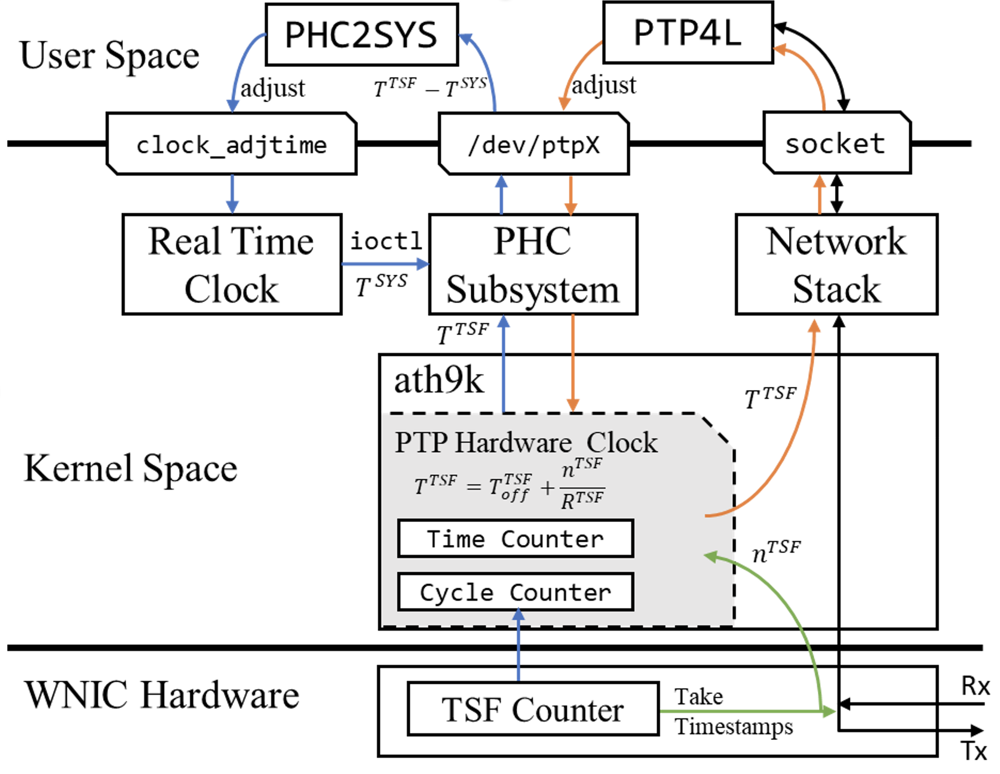

Wi-PTP

## Abstract

Emerging mobile applications involving distributed control and sensing call for accurate time synchronization over wireless links. This paper systematically studies the performance of Precision Time Protocol (PTP) in today's Wi-Fi networks. We investigate both software and hardware PTP implementations. Our study uncovers the root causes of software PTP synchronization errors. We show that with fine-tuned system configurations and an online calibration procedure, software PTP can achieve reasonable accuracy with off-the-shelf Wi-Fi devices. Hardware PTP requires a PTP hardware timestamper clock not contained in Wi-Fi NICs. We propose a method to make use of the hardware TSF counter to emulate the PTP clock. Rigorous tests traversing various conditions show that both software and hardware PTP implementations can achieve a 1-μs level of accuracy in today's Wi-Fi networks.



The above figure illustrates how Wi-PTP works.

## Usage

The `ath9k` directory contains the modified ath9k driver based on Linux Kernel 4.19.37. The `ptp` directory contains the adjusted [linuxptp](http://linuxptp.sourceforge.net/).

### Build & Replace ath9k Driver

1. Replace `drivers/net/wireless/ath/ath9k` in the Kernel source tree with this repo's `ath9k`. We recommend `rsync` to do this:

```bash
    rsync -avP <repo path>/ath9k <kernel source>/drivers/net/wireless/ath/
```

2. Build ath9k driver.

```bash
    cd <kernel source>

    make M=drivers/net/wireless/ath
```

3. Replace the ath9k driver.

```bash
WLAN_DEV=wlan0

ifdown ${WLAN_DEV}

rmmod ath9k
rmmod ath9k_common
rmmod ath9k_hw
rmmod ath

cd <kernel source>/drivers/net/wireless/ath
insmod ./ath.ko
insmod ./ath9k/ath9k_hw.ko
insmod ./ath9k/ath9k_common.ko
insmod ./ath9k/ath9k.ko

sleep 1

ifup ${WLAN_DEV}
```

Note: please replace the `wlan0` above with the actual ath9k interface.

4. Check for the PTP device.

```bash
    ls /sys/class/net/${WLAN_DEV}/device/ptp
```

The above command should output a `ptp<X>`.

### Build linuxptp

```bash
    cd <repo path>/ptp

    make
```

After building the `linuxptp`, the ar9300+ wireless cards can be used to perform PTP as ethernet cards.

## Citation

Use this bibtex to cite the paper:

```plain
@inproceedings {273763,
title = {Understanding Precision Time Protocol in Today{\textquoteright}s Wi-Fi Networks: A Measurement Study},
booktitle = {2021 {USENIX} Annual Technical Conference ({USENIX} {ATC} 21)},
year = {2021},
url = {https://www.usenix.org/conference/atc21/presentation/chen},
publisher = {{USENIX} Association},
month = jul,
}
```

## Contact

If you have any questions, please don't hesitate to contact [chenpzh@shanghaitech.edu.cn](mailto:chenpzh@shanghaitech.edu.cn).

